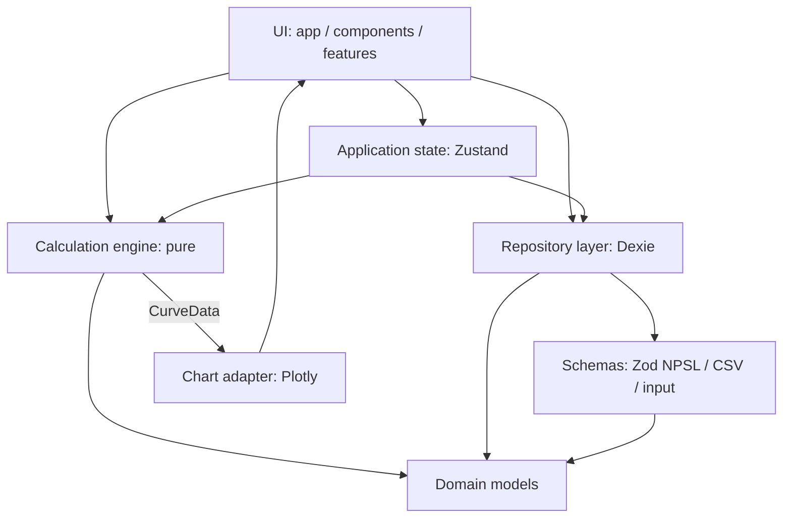

# Architecture

This document is the authoritative description of how Neuropharmacology
Sandbox is structured, how data and control flow through it, and which rules
must not be broken when extending it.

Related documents: [domain model](domain-model.md),
[calculation engine](calculation-engine.md), [provenance](provenance.md),
[NPSL format](npsl-format.md), [validation](validation.md),
[testing](testing.md), [decisions](decisions.md),
[spec review](spec-review.md).

---

## 1. Technology stack (finalized)

| Concern | Choice | Why |
| --- | --- | --- |
| Language | TypeScript (strict, `noUncheckedIndexedAccess`, `exactOptionalPropertyTypes`) | Scientific data types must be checked exhaustively |
| Build | Vite 8 | Fast, static output, no backend required |
| UI | React 19 | Spec requirement; ecosystem maturity |
| Styling | Tailwind CSS 4 + shadcn/ui (radix base) | Professional, restrained, accessible components |
| Icons | lucide-react | Consistent icon set; **emoji are never used as UI** |
| Routing | React Router 7 (central route table) | Spec requirement |
| State | Zustand (application state only) | Spec requirement; local state remains the default |
| Validation | Zod 4 | One validation language for files, inputs and config |
| Charts | Plotly.js behind a project-owned curve abstraction | Spec requirement; charts must never compute pharmacology |
| Numerics | Decimal.js | Deterministic decimal arithmetic for displayed results |
| Persistence | IndexedDB via Dexie.js | Local-first, offline, transactional imports |
| Unit tests | Vitest + React Testing Library | Fast, same transform pipeline as Vite |
| E2E | Playwright | Important user workflows end to end |
| Lint | oxlint | Fast, zero-config linting |

Deployment target: any static host (Cloudflare Pages, GitHub Pages). No
backend, no authentication, no cloud sync, no LLM.

---

## 2. Layer diagram

Strict top-down dependencies. A layer may only import from layers below it.

```
┌──────────────────────────────────────────────────────────────────┐
│  UI (React components, pages, charts)                            │
│  src/app/**  src/components/**  src/features/**                  │
└───────────────┬──────────────────────────────────────────────────┘
                │  props/events only, no formulas here
┌───────────────▼──────────────────────────────────────────────────┐
│  Application state (Zustand stores, one per feature)             │
│  src/features/<feature>/store.ts                                 │
└───────┬───────────────────────────────┬──────────────────────────┘
        │                               │
┌───────▼───────────────┐   ┌───────────▼──────────────────────────┐
│  Calculation engine   │   │  Repository / persistence            │
│  src/engine/**        │   │  src/data/repositories/**            │
│  pure functions       │   │  Dexie (IndexedDB)                   │
└───────┬───────────────┘   └───────────┬──────────────────────────┘
        │                               │
┌───────▼───────────────────────────────▼──────────────────────────┐
│  Domain models (types + invariants)                             │
│  src/domain/**  — drug, pharmacology, provenance, library, units │
└───────────────┬──────────────────────────────────────────────────┘
                │
┌───────────────▼──────────────────────────────────────────────────┐
│  Serialization / file formats                                    │
│  src/data/schemas/**  (Zod: NPSL, CSV mapping, calculator input) │
│  src/data/built-in/** (bundled demo libraries)                   │
└──────────────────────────────────────────────────────────────────┘
```

Mermaid version:



### Layer rules (enforced by review + tests)

1. **UI** renders; it never contains pharmacological formulas, unit
   conversions or rounding rules. Components receive already-computed
   `CalculationReport` / `CurveData` objects.
2. **Application state** orchestrates (selection, drafts, async loading). It
   calls the engine and repositories; it does not reimplement their logic.
   Stores are per-feature, not a single global blob.
3. **Calculation engine** is pure: no React, no Zustand, no IndexedDB, no DOM,
   no network, no ambient time or randomness. Same input → same output.
   (Enforced by review; a lint rule for forbidden imports is planned.)
4. **Domain models** are plain types plus small pure guards. They import
   nothing from layers above.
5. **Persistence** sits behind a repository interface
   (`getAllDrugs`, `getDrug`, `createDrug`, `updateDrug`, `deleteDrug`,
   `importLibrary`, `exportLibrary`). React never touches Dexie directly.
6. **Serialization** (NPSL/CSV) lives in `src/data`, never inside components
   or the engine. Import/export can change without touching either.

### Why the data layer is independent

`src/data` depends on `src/domain` only. The engine never reads files or the
database; it accepts plain input objects. This is what makes the engine
independently testable and the library format replaceable.

---

## 3. Directory structure

```
src/
├── app/                     # application shell
│   ├── App.tsx              # RouterProvider
│   ├── routes.tsx           # central route table
│   ├── layout/              # AppLayout, PageHeader
│   └── pages/               # route-level views (thin; delegate to features)
├── components/
│   ├── ui/                  # shadcn/ui primitives (generated, treat as vendor code)
│   ├── charts/              # CurveData -> Plotly adapters (phase 5)
│   └── forms/               # shared scientific input controls (phase 4)
├── features/                # one folder per feature (phase 3+)
│   ├── drug-library/        #   list, detail, editing, store
│   ├── pharmacokinetics/    #   PK calculator UI
│   ├── receptor-occupancy/  #   occupancy calculator UI
│   ├── dose-response/       #   Hill calculator UI
│   └── import-export/       #   import wizard, export dialog, store
├── domain/                  # pure domain types and guards
│   ├── drug/                #   Drug, ReceptorTarget, Pharmacokinetics
│   ├── pharmacology/        #   ScientificValue, units + unit catalog
│   ├── provenance/          #   Provenance union + guards
│   └── library/             #   DrugLibrary, LibraryMetadata
├── engine/                  # pure calculation engine (all 3 MVP models implemented, phase 2)
│   ├── types.ts             #   CalculationReport, trace, CurveData contracts
│   ├── index.ts             #   public API barrel
│   ├── registry.ts          #   ModelDescriptor registry (labels, formulas, assumptions)
│   ├── numeric/             #   Decimal helpers: 12-digit report rounding, loss detection
│   ├── validate/            #   shared input validation → typed CalculationError
│   ├── units/               #   dimension checks + unit conversion used by models
│   ├── trace/               #   helpers to build calculation traces
│   ├── curve/               #   chart-agnostic range validation + x-sampling
│   ├── pk/                  #   first-order one-compartment model + curve generator
│   ├── occupancy/           #   single-site binding model + curve generator
│   └── dose-response/       #   Hill equation + curve generator
├── data/
│   ├── schemas/             # Zod schemas (NPSL now; calculator input, CSV later)
│   ├── built-in/            # bundled demo libraries (marked example/demo)
│   └── repositories/        # repository interface + Dexie implementation (phase 3)
├── tests/
│   ├── setup.ts             # Vitest setup (jest-dom matchers)
│   └── fixtures/            # synthetic, explicitly-marked test fixtures
└── ...
e2e/                         # Playwright specs
docs/                        # this documentation
```

Adjusting folder names is fine; the **separations** are not negotiable:
`domain`, `engine`, `data`, `features`, `components`, `app`.

---

## 4. Data flows

### 4.1 Application start

```
IndexedDB (Dexie)
   → repository.getAllDrugs() + metadata
   → schema/migration validation        (never silently discard data)
   → Zustand store hydration
   → UI render
```

### 4.2 Modification (create / edit / delete)

```
user action
   → Zod validation of the draft (calculator inputs, drug form)
   → domain invariants checked
   → Dexie transaction (atomic)
   → Zustand state update
   → UI re-render
```

A failed validation leaves both IndexedDB and application state untouched.

### 4.3 Calculation

```
calculator inputs (validated)
   → engine model.calculate(input)
   → CalculationReport
        ok: true  → inputs, formula, trace, outputs, assumptions, warnings
        ok: false → CalculationError[] (e.g. MISSING_PARAMETER)
   → result panel + calculation details (UI)
   → optional: generateCurve() → CurveData → chart adapter → Plotly
```

### 4.4 Import (all-or-nothing)

```
file (.npsl / JSON / CSV)
   → read & JSON/CSV parse
   → Zod schema validation           (src/data/schemas)
   → version compatibility check
   → semantic validation             (units, duplicates, provenance rules)
   → preview (counts, warnings, per-record status)
   → user confirms
   → single Dexie transaction writes the library
   → on any error: abort → existing library unchanged
```

### 4.5 Export

```
Zustand/repository data
   → NPSL serializer (preserves provenance, metadata, versions)
   → file download          .npsl / .json  (lossless)
   → CSV projection         (lossy; provenance flattened to columns — see
                             validation.md §5 and spec-review.md §6)
```

---

## 5. Routes

| Path | View | Phase |
| --- | --- | --- |
| `/` | redirect → `/library` | 1 (done) |
| `/library` | Drug Library | 2 |
| `/library/:drugId` | Drug Detail (Overview / Pharmacokinetics / Targets / Provenance tabs) | 2 |
| `/calculator` | Calculator (model selector, inputs, results, trace, charts) | 3 |
| `/import-export` | Import / Export | 4 |
| `/settings` | Settings | 4 |
| `*` | Not found | 1 (done) |

All placeholder views exist in `src/app/pages/` so routing, layout and
navigation are already wired and tested.

---

## 6. Roadmap (aligned with the MVP priority order)

| Phase | Deliverable | Depends on | Status |
| --- | --- | --- | --- |
| 1 | Architecture, domain types, NPSL schema + tests, app shell, test harness | — | done |
| 2 | Calculation engine models (PK, occupancy, Hill) + unit catalog + full unit tests + hardening (log y-axis validation, consistent numerical-loss policy, invariant coverage, CI) | 1 | done |
| 3 | Drug library: Dexie repository, IndexedDB schema + migrations, startup hydration, transactional NPSL import, minimal library UI | 1, 2 | current |
| 4 | Calculator UI + calculation trace rendering | 2, 3 | pending |
| 5 | Charts (CurveData → Plotly adapters, linear/log controls) | 4 | pending |
| 6 | Import/export UI (.npsl, JSON, CSV with field mapping) + round-trip tests | 3 | pending |
| 7 | Accessibility polish, keyboard workflows, e2e coverage | all | pending |

The core NPSL import path (parse → schema → semantic validation → atomic
commit) ships with phase 3 at the repository level; phase 6 adds the full
import/export UI (field mapping, CSV).

Out of scope for the MVP (explicitly): backend, accounts, LLM features,
dose → effect models, occupancy → subjective effect models, any parameter not
supplied by data.

---

## 7. Commands

| Command | Purpose |
| --- | --- |
| `npm run dev` | Vite dev server |
| `npm run build` | `tsc -b` + production build → `dist/` |
| `npm run typecheck` | Strict type check |
| `npm run lint` | oxlint |
| `npm test` | Vitest (unit, schema, component) |
| `npm run test:coverage` | Coverage for domain/engine/data |
| `npm run test:e2e` | Playwright (first run: `npx playwright install chromium`) |

Known tooling notes:

- `npm audit` reports vulnerabilities in the `shadcn` **CLI devDependency**
  only (transitive dev tooling). It is not shipped in the build.
- `es5-ext` postinstall warning comes from Plotly's dependency chain and is
  harmless.
