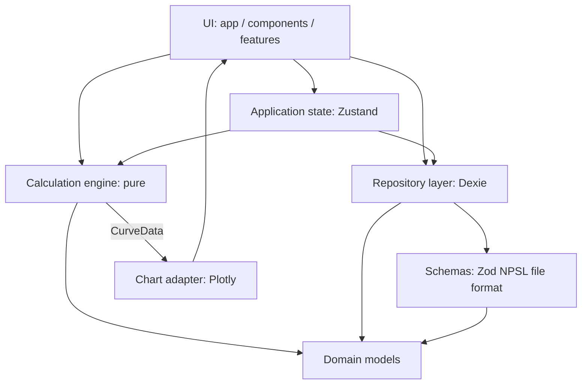

# Architecture

This document is the authoritative description of how Neuropharmacology
Sandbox is structured, how data and control flow through it, and which rules
must not be broken when extending it.

Related documents: [domain model](domain-model.md),
[calculation engine](calculation-engine.md), [provenance](provenance.md),
[NPSL format](npsl-format.md), [validation](validation.md),
[testing](testing.md), [decisions](decisions.md),
[spec review](spec-review.md).

---

## 1. Technology stack (finalized)

| Concern | Choice | Why |
| --- | --- | --- |
| Language | TypeScript (strict, `noUncheckedIndexedAccess`, `exactOptionalPropertyTypes`) | Scientific data types must be checked exhaustively |
| Build | Vite 8 | Fast, static output, no backend required |
| UI | React 19 | Spec requirement; ecosystem maturity |
| Styling | Tailwind CSS 4 + shadcn/ui (radix base) | Professional, restrained, accessible components |
| Icons | lucide-react | Consistent icon set; **emoji are never used as UI** |
| Routing | React Router 7 (central route table) | Spec requirement |
| State | Zustand (application state only) | Spec requirement; local state remains the default |
| Validation | Zod 4 | One validation language for files, inputs and config |
| Charts | Plotly.js behind a project-owned curve abstraction | Spec requirement; charts must never compute pharmacology |
| Numerics | Decimal.js | Deterministic decimal arithmetic for displayed results |
| Persistence | IndexedDB via Dexie.js | Local-first, offline, transactional imports |
| Unit tests | Vitest + React Testing Library | Fast, same transform pipeline as Vite |
| E2E | Playwright | Important user workflows end to end |
| Lint | oxlint | Fast, zero-config linting |

Deployment target: any static host (Cloudflare Pages, GitHub Pages). No
backend, no authentication, no cloud sync, no LLM.

---

## 2. Layer diagram

Strict top-down dependencies. A layer may only import from layers below it.

```
┌──────────────────────────────────────────────────────────────────┐
│  UI (React components, pages, charts)                            │
│  src/app/**  src/components/**  src/features/**                  │
└───────────────┬──────────────────────────────────────────────────┘
                │  props/events only, no formulas here
┌───────────────▼──────────────────────────────────────────────────┐
│  Application state (Zustand stores, one per feature)             │
│  src/features/<feature>/store.ts                                 │
└───────┬───────────────────────────────┬──────────────────────────┘
        │                               │
┌───────▼───────────────┐   ┌───────────▼──────────────────────────┐
│  Calculation engine   │   │  Repository / persistence            │
│  src/engine/**        │   │  src/data/repositories/**            │
│  pure functions       │   │  Dexie (IndexedDB)                   │
└───────┬───────────────┘   └───────────┬──────────────────────────┘
        │                               │
┌───────▼───────────────────────────────▼──────────────────────────┐
│  Domain models (types + invariants)                             │
│  src/domain/**  — drug, pharmacology, provenance, library, units │
└───────────────┬──────────────────────────────────────────────────┘
                │
┌───────────────▼──────────────────────────────────────────────────┐
│  Serialization / file formats                                    │
│  src/data/schemas/**  (Zod: NPSL file format; CSV maps onto it)   │
└──────────────────────────────────────────────────────────────────┘
```

Calculator input schemas are Zod too, but they are not an interchange
format: they live next to the calculator feature
(`src/features/calculator/schemas.ts`) and validate form drafts.

Mermaid version:



### Layer rules (enforced by review + tests)

1. **UI** renders; it never contains pharmacological formulas, unit
   conversions or rounding rules. Components receive already-computed
   `CalculationReport` / `CurveData` objects.
2. **Application state** orchestrates (selection, drafts, async loading). It
   calls the engine and repositories; it does not reimplement their logic.
   Stores are per-feature, not a single global blob.
3. **Calculation engine** is pure: no React, no Zustand, no IndexedDB, no DOM,
   no network, no ambient time or randomness. Same input → same output.
   (Enforced by review; a lint rule for forbidden imports is planned.)
4. **Domain models** are plain types plus small pure guards. They import
   nothing from layers above.
5. **Persistence** sits behind a repository interface
   (`getAllDrugs`, `getDrug`, `createDrug`, `updateDrug`, `deleteDrug`,
   `importLibrary`, `exportLibrary`). React never touches Dexie directly.
6. **Serialization** (NPSL/CSV) lives in `src/data`, never inside components
   or the engine. Import/export can change without touching either.

### Why the data layer is independent

`src/data` depends on `src/domain` only. The engine never reads files or the
database; it accepts plain input objects. This is what makes the engine
independently testable and the library format replaceable.

---

## 3. Directory structure

```
src/
├── app/                     # application shell
│   ├── App.tsx              # RouterProvider
│   ├── routes.tsx           # central route table
│   ├── libraryStore.ts      # composition root: Dexie repository + Zustand store
│   ├── calculatorStore.ts   # composition root: calculator session store
│   ├── preferencesStore.ts  # composition root: preferences ↔ calculator wiring (phase 9B)
│   ├── layout/              # AppLayout, PageHeader
│   └── pages/               # route-level views (thin; delegate to features)
├── components/
│   ├── ui/                  # shadcn/ui primitives (generated, treat as vendor code)
│   └── charts/              # CurveData -> Plotly adapter + lazy chart component (phase 4)
├── features/                # one folder per feature
│   ├── drug-library/        #   list/detail/form views (phase 3)
│   ├── calculator/          #   model adapter registry, input drafts, session store,
│   │                        #   CalculatorView (phase 4)
│   │   ├── schemas.ts       #   Zod structural validation of form drafts
│   │   ├── store.ts         #   drafts, report, stale flags, curve settings
│   │   └── components/      #   ParameterField, ResultPanel, CalculationTrace,
│   │                        #   VisualizationPanel, ErrorPanel, ProvenanceBadge
│   └── import-export/       #   import/export UI (phase 5)
│       ├── csv/             #   RFC 4180 reader/writer, stable CSV schema,
│       │                    #   explicit mapping -> versioned NPSL document
│       ├── ImportPanel.tsx  #   file -> preview -> confirm -> report flow
│       ├── CsvMappingCard.tsx #  explicit column mapping + fixed-unit policy
│       ├── ExportPanel.tsx  #   whole-library .npsl/.json/.csv downloads
│       └── fileIo.ts        #   readTextFile, downloadTextFile (object URLs)
├── domain/                  # pure domain types and guards
│   ├── drug/                #   Drug, ReceptorTarget, Pharmacokinetics
│   ├── pharmacology/        #   ScientificValue, units + unit catalog
│   ├── provenance/          #   Provenance union + guards
│   └── library/             #   DrugLibrary, LibraryMetadata
├── engine/                  # pure calculation engine (all 3 MVP models implemented, phase 2)
│   ├── types.ts             #   CalculationReport, trace, CurveData contracts
│   ├── index.ts             #   public API barrel
│   ├── registry.ts          #   ModelDescriptor registry (labels, formulas, assumptions)
│   ├── input.ts             #   engine input types (one per model)
│   ├── numeric/             #   Decimal helpers: 12-digit report rounding, loss detection
│   ├── validate/            #   shared input validation → typed CalculationError
│   ├── units/               #   dimension checks + unit conversion used by models
│   ├── trace/               #   helpers to build calculation traces
│   ├── curve/               #   chart-agnostic range validation + x-sampling
│   ├── pk/                  #   first-order one-compartment model + curve generator
│   ├── occupancy/           #   single-site binding model + curve generator
│   └── dose-response/       #   Hill equation + curve generator
├── data/
│   ├── schemas/             # Zod schemas (NPSL file format; CSV builds an NPSL document first)
│   ├── db/                  # single versioned Dexie module + upgrade hooks (phase 3)
│   ├── mappers/             # persistence DTO <-> domain, NPSL export document
│   ├── import/              # NPSL parse -> schema -> semantic -> preview pipeline
│   ├── id.ts                # stable id helpers
│   └── repositories/        # repository interface + Dexie implementation (phase 3)
├── tests/
│   ├── setup.ts             # Vitest setup (jest-dom matchers)
│   ├── report.ts            # shared report assertion helpers
│   ├── fixtures.ts          # synthetic, explicitly-marked test fixtures
│   └── fixtures/            # example NPSL library (marked example data)
└── ...
e2e/                         # Playwright specs: shell, calculator, import/export,
                             # library persistence, keyboard workflows, accessibility scans
docs/                        # this documentation
```

Adjusting folder names is fine; the **separations** are not negotiable:
`domain`, `engine`, `data`, `features`, `components`, `app`.

---

## 4. Data flows

### 4.1 Application start

```
IndexedDB (Dexie)
   → repository.getAllDrugs() + metadata
   → schema/migration validation        (never silently discard data)
   → Zustand store hydration
   → UI render
```

### 4.2 Modification (create / edit / delete)

```
user action
   → Zod validation of the draft (calculator inputs, drug form)
   → domain invariants checked
   → Dexie transaction (atomic)
   → Zustand state update
   → UI re-render
```

A failed validation leaves both IndexedDB and application state untouched.

### 4.3 Calculation

```
Calculator draft (Zustand, per model; PK mode is a discriminant)
   ↓
Zod structural validation           (presence, finite number, unit present —
                                     never a scientific rule)
   ↓
model adapter                       (draft → engine input; provenance only
                                     from an explicit library load)
   ↓
scientific engine                   (pure; the single scientific authority)
   ↓
CalculationReport
     ok: true  → inputs, formula, trace, outputs, assumptions, warnings
     ok: false → CalculationError[] (rendered verbatim, mapped to fields)
   ↓
result panel + calculation trace    (UI; no formula is recreated there)
   ↓  explicit range + "Update curve" — never automatic
CurveData                           (engine sampling; warnings attached,
                                     point data never altered)
   ↓
chart adapter                       (CurveData → Plotly traces/layout;
                                     never computes pharmacology)
   ↓
Plotly chart (lazy-loaded)
```

No layer between the draft and the engine applies a scientific rule, and
no layer after the engine alters curve data — axis fallbacks change the
display only (see ADR-16).

### 4.4 Import (all-or-nothing)

```
file (.npsl / JSON / CSV)
   → read & JSON/CSV parse (CSV: RFC 4180, line-numbered errors)
   → CSV only: explicit column mapping + declared unit policy → a
               versioned NPSL document (no value is ever inferred)
   → version compatibility check
   → Zod schema validation           (src/data/schemas)
   → semantic validation             (units, duplicates, provenance rules)
   → preview (counts, warnings, per-record status; CSV declarations)
   → user confirms   (replace additionally requires an acknowledgement)
   → single Dexie transaction writes the library
   → on any error: abort → existing library unchanged
```

The UI (phase 5, `src/features/import-export/`) owns only presentation
and confirmation: file selection and preview are read-only, and the
single write path is the store's `importLibrary` → repository transaction
(same pipeline, re-validated inside the transaction).

Two follow-up rules keep import outcomes and forward compatibility honest:

- **Commit vs. refresh.** The store separates the transaction from the
  session re-read that follows it. `ok` and `committed-refresh-failed`
  both mean the records are in the database; the latter carries the
  original refresh error, leaves the session visibly stale, and offers a
  hydrate retry — a committed import is never reported as a rollback and
  never re-run automatically. `invalid`/`failed` mean nothing was written.
- **Extension (unknown-field) preservation.** Unknown keys accepted by
  the loose schema are written from the incoming file (replace and
  first-time merge) and kept from storage when the file never mentioned
  them; a collision is won by the incoming file. Metadata extensions
  survive a replace via `resolveLibraryMetadata`; merge never touches
  library metadata. Envelope-level extras have no storage location and
  surface as warning `ENVELOPE_FIELDS_DROPPED`
  (details: `docs/npsl-format.md` §6).

### 4.5 Export

```
repository exportLibrary()
   → validated records only    (quarantined records are excluded — the UI
                                shows an explicit notice with the count)
   → NPSL serializer (preserves provenance, metadata, versions, extensions)
   → file download          .npsl / .json  (lossless for records, provenance
                                             and extensions; envelope-level
                                             extras are never stored — see §4.4)
   → CSV projection         (lossy; provenance flattened to columns, text
                             cells formula-guarded with a leading
                             apostrophe — validation.md §7 and spec-review.md §6)
```

None of these three exports is a complete storage snapshot: quarantined
raw rows are excluded from all of them and the UI announces the excluded
count, so ordinary exports must never be presented as full backups. The
full-storage format is the separate `.npsb` recovery archive (phase 8 —
[recovery-backup.md](recovery-backup.md), ADR-18): the contract was
designed in 8A and export/restore is implemented and verified in 8B
(`src/data/recovery/`, the repository/store restore paths, the Recovery
tab). Ordinary exports remain interchange-only, as above.

### 4.6 Calculator state (session-only)

The calculator store is transient UI state; it never touches IndexedDB
(the library remains the source of truth) and it holds only these
architectural guarantees:

```
Calculator Zustand store
├── draft                active model + its inputs (PK mode discriminant)
├── report               last CalculationReport (null | ok | failed)
├── stale                inputs changed since `report` was calculated
├── curve                last CurveData for the explicit range (else null)
├── curveSettingsStale   range/scale settings changed since `curve` was
│                        generated — an old curve is never presented as current
└── settings             per-model curve settings: explicit range, points,
                         x/y scales (session state — the *saved defaults*
                         live in the preferences store, §4.7, and are
                         applied to this store at startup)
```

`stale` and `curveSettingsStale` are independent on purpose: editing an
input does not claim the curve is out of date with respect to its
settings, and changing the range does not claim the numeric result is
out of date with respect to its inputs.

### 4.7 Application preferences (device-local, phase 9B)

`/settings` manages two kinds of *presentation* preference, stored in
**one versioned `localStorage` record** (key
`neuropharmacology-sandbox.preferences`, structure
`{version: 1, theme, calculator: {settings}}`; ADR-19) — deliberately
outside IndexedDB so the scientific storage schema and record formats
stay untouched:

- **Theme** — `system | light | dark` (documented default: `system`,
  which follows the operating system). The effective choice is applied
  as the `.dark` class on the document root — the existing
  `@custom-variant dark` convention, one mechanism, one writer —
  synchronously at startup from `main.tsx`, before the first render, so
  the app paints in the chosen theme. System mode follows
  `prefers-color-scheme` live; a manual Light/Dark choice is never
  overridden by a later OS change.
- **Calculator display defaults** — the per-model curve settings
  (`Record<ModelId, CurveSettings>`: explicit range, points, x/y scales)
  each model starts with. The defaults themselves are defined exactly
  once, in `features/calculator/store.ts`
  (`defaultCalculatorSettings()`); the persisted copy is validated with
  Zod **and** the engine's own `validateCurveOptions`, then pushed into
  the calculator session store at startup (`applyPresentationSettings`)
  and on every Settings change. Curve ranges and axis scales are
  presentation configuration — the chart never computes pharmacology —
  so nothing scientific is stored here.

Boundary: **preferences never hold scientific state.** Input drafts,
reports, curve data, drug records and provenance are not read or written
by the preferences layer, and the scoped "Reset application
preferences" action restores only the theme and the calculator display
defaults.

Failure handling: malformed JSON, invalid values and unsupported
versions are discarded wholesale in favour of the documented defaults
(announced in a `role="status"` note); a browser that denies storage
runs from in-memory defaults with the same note. Range fields accept
only blank-or-finite non-negative numbers (points: blank or an integer
in the engine's 2–5000 bounds), and a fully entered range must satisfy
the engine's cross-field rules before it is stored — invalid text stays
visible next to its message and is never persisted.

---

## 5. Routes

| Path | View | Phase |
| --- | --- | --- |
| `/` | redirect → `/library` | 1 (done) |
| `/library` | Drug Library (list, filter, quarantine report, create entry point) | 3 (done) |
| `/library/new` | New Drug Record (create form, explicit units) | 3 (done) |
| `/library/:drugId` | Drug Detail (targets, read-only PK, provenance, edit/delete, Calculate link) | 3 (done) |
| `/calculator` | Calculator — **implemented**: model selector, input forms, results, calculation trace, curve controls + charts | 4 (done) |
| `/import-export` | Import / Export — placeholder (header only) | 5 |
| `/settings` | Settings — **implemented**: theme, per-model curve display defaults, data-management links, About, scoped preference reset | 9 (done) |
| `*` | Not found | 1 (done) |

Every route has a page in `src/app/pages/` so routing, layout and
navigation are wired and tested; `/import-export` delegates to the
phase-5 import/export feature and `/settings` (phase 9B) manages
device-local presentation preferences — see §4.7.

---

## 6. Roadmap (aligned with the MVP priority order)

| Phase | Deliverable | Depends on | Status |
| --- | --- | --- | --- |
| 1 | Architecture, domain types, NPSL schema + tests, app shell, test harness | — | done |
| 2 | Calculation engine models (PK, occupancy, Hill) + unit catalog + full unit tests + hardening (log y-axis validation, consistent numerical-loss policy, invariant coverage, CI) | 1 | done |
| 3 | Drug library: Dexie repository, IndexedDB schema + migrations, startup hydration, transactional NPSL import, minimal library UI | 1, 2 | done |
| 4 | Calculator + scientific visualization: model selector, explicit parameter inputs with provenance-aware library loading, results with calculation traces, CurveData → Plotly chart adapter, linear/log controls, log-Y representability handling, curve settings state — plus the hardening pass (PK mode union fix, stale-state semantics, curve readiness separation) and the critical calculator E2E workflows | 2, 3 | done |
| 5 | Import/export UI (.npsl, JSON, CSV with field mapping) + round-trip tests | 3 | done |
| 6 | Accessibility, keyboard workflows and library persistence E2E: semantic headings/landmarks/page titles, skip link with focus placement, accessible names and announced errors (`aria-invalid` / `aria-describedby` / `role="alert"` / `role="status"`), every core workflow operable without a mouse (library incl. row add/remove and validation recovery, calculator incl. PK parameterization, import/export incl. tabs and the replace gate), axe-core WCAG A/AA scans, a real-IndexedDB library persistence spec, narrow-viewport operability — plus the invalid-Calculate-silently-ignored fix and the URL ⇄ store deep-link loop fix | all | done |
| 7 | Dependency security audit and safe remediation: evidence-based `npm audit` baseline (all-tree and `--omit=dev`), full dependency-path evidence for every finding, a blocking production-dependency audit in CI plus a non-blocking full-tree report, and a documented unresolved dev-only advisory with its re-check condition | – | done |
| 8 | Lossless recovery backup for quarantined records: a separate versioned `.npsb` archive (raw valid + quarantined rows, all metadata rows, explicit fidelity boundary with numeric sidecar), replace-only restore with pre-write validation, atomic commit and commit-aware outcomes — **8A: format contract + ADR-18 (this documentation phase only)**; **8B: export/restore implementation and verification** | 3 | 8A: done · 8B: done |
| 9 | Settings: device-local presentation preferences — persistent theme (system/light/dark, `.dark` on the document root, live OS follow), per-model curve display defaults with Zod + engine validation, data-management links, About, and a scoped acknowledged reset — scientific data neither stored nor touched | 4 | done |

The core NPSL import path (parse → schema → semantic validation → atomic
commit) ships with phase 3 at the repository level; phase 5 added the full
import/export UI (explicit CSV column mapping, preview/confirm flows,
whole-library downloads).

Out of scope for the MVP (explicitly): backend, accounts, LLM features,
dose → effect models, occupancy → subjective effect models, any parameter not
supplied by data.

### Definition of done — Phase 2 hardening (delivered)

- [x] README status reflects the true phase state (1–2 done, next phase
      current) and the remaining roadmap.
- [x] Log-Y axis: non-positive or non-finite points are reported as one
      structured warning (`LOG_Y_AXIS_NOT_REPRESENTABLE`); curve data is
      never removed, clamped or mutated; tests cover positive, zero,
      negative, underflowed-zero and unchanged linear runs.
- [x] Numerical loss: mathematical zeros stay warning-free while
      underflowed/rounded values are labelled, consistently across scalar
      outputs **and** trace intermediates; regression tests for extreme
      Hill ratios/powers and collapsed exponentials.
- [x] Scientific invariants verified (PK: C(0)=C0, C(t½)=C0/2, monotonic,
      t½↔k; occupancy: bounds, monotonic, [D]=Kd→0.5; Hill: [D]=0→E0,
      [D]=EC50→f=0.5, monotonic both signs, no default n, no parameter-kind
      substitution) — without adding models.
- [x] Minimal GitHub Actions CI: `npm ci` → typecheck → lint → test →
      build, plus the Playwright smoke test; no deploy/release/caching
      complexity.
- [x] Docs updated (engine warning/loss policy, roadmap, cross-references);
      all gates green; `src/engine` stays free of React/Plotly/Zustand/Dexie.

### Definition of done — Phase 3 drug library + local persistence (delivered)

- [x] Layering: UI → feature → repository interface → Dexie → IndexedDB;
      React, engine and domain modules never import Dexie (only the
      database module and the composition root reference it).
- [x] One versioned database module: v1 → v2 upgrade backfills bookkeeping
      only; scientific data and unknown fields survive byte-for-byte
      (migration demo test), new indexes usable afterwards.
- [x] Repository interface (getAllDrugs, getDrug, createDrug, updateDrug,
      deleteDrug, getLibraryMetadata, replaceLibrary, importLibrary,
      exportLibrary) speaking domain objects only; persistence-DTO vs
      domain decision documented (ADR-14).
- [x] Hydration with quarantine: invalid records are reported with id and
      errors, never silently dropped or deleted (ADR-15).
- [x] Atomic multi-record operations: replace/import validate inside the
      transaction; failures roll back to the previous library untouched;
      import pipeline is parse → NPSL schema → semantic → preview →
      transaction, all-or-nothing.
- [x] Library metadata `{name, author, description, createdAt, updatedAt,
      dataStatus}` with a documented first-run default; stable UUID ids for
      drugs and targets (never names or positions).
- [x] Storage origin (`origin`) kept separate from scientific provenance;
      provenance triples never flattened; NPSL is the only interchange
      format (export → import round trip is identity).
- [x] Zustand holds session state only; IndexedDB stays the source of
      truth and reload persistence is proven by tests (ADR-17).
- [x] Minimal UI only: list, select, create, edit, delete, provenance
      display, reload persistence — no calculator UI, charts, search,
      dashboards or AI.
- [x] Scientific editing safeguards: explicit units from the catalog (no
      silent default), finite non-negative number validation, unchanged
      parameters keep their complete provenance on edit (matched by stable
      target id, parsed value and unit), only new or actually changed
      parameters are stamped `user` at submit, and provenance is never
      upgraded by the UI.
- [x] No invented pharmacological data: fixtures are synthetic and labeled
      as such; the first run is empty.
- [x] Extensive tests (mapper, migration, import pipeline, repository,
      store, views); ADR-14…17 written; docs/tree/status updated; all
      gates green; `src/engine` purity re-verified.

### Definition of done — Phase 4 calculator + visualization (delivered)

- [x] Model selector populated from the engine registry; input forms
      driven by adapter field specs; PK parameterization is a
      discriminated union with an explicit mode toggle that preserves
      typed input in both directions.
- [x] Explicit inputs only: no scientific default anywhere; Zod performs
      structural validation before the engine runs and engine errors are
      rendered verbatim and mapped back to their fields.
- [x] Provenance-aware library loading: candidates appear only for the
      record in context and are loaded only by explicit selection;
      provenance rides into the report's inputs; typed values make no
      source claim; nothing is ever auto-selected or upgraded.
- [x] Full result rendering: outputs, formula, inputs used with
      provenance badges, assumptions, warnings, structured calculation
      trace.
- [x] CurveData → Plotly behind the project-owned chart adapter (lazy
      chart), explicit range + "Update curve", linear/log x/y controls,
      `LOG_Y_AXIS_NOT_REPRESENTABLE` falls back to a linear y-axis while
      the warning is surfaced verbatim; the chart never computes
      pharmacology.
- [x] Stale semantics: input edits, library loads and PK mode switches
      mark the result stale; curve settings changes are tracked
      separately (`curveSettingsStale`) so an old curve is never
      presented as current (readiness and settings are independent).
- [x] Hardening pass: union-safe test fixtures and adapters (0
      TypeScript errors, no weakened types), no `@ts-ignore`/`any`
      escapes, dropped tests restored.
- [x] Critical E2E workflows (synthetic records only): occupancy
      calculation, PK mode-switch regression, drug → calculator with
      explicit load, stale-state transitions, curve workflow.
- [x] Docs synchronized with the implementation (README, this document);
      all gates green: typecheck, lint, unit tests, build, E2E.

### Definition of done — Phase 6 accessibility, keyboard workflows and library persistence E2E (delivered)

- [x] Structure: one `h1` per route with level-2 section headings (the
      vendored `CardTitle` gained an opt-in `headingLevel`), landmarks,
      `aria-current="page"` on the active route, `<Route> —
      Neuropharmacology Sandbox` document titles, and a skip link that moves
      focus to the `#main-content` target (focus also lands on `<main>` after
      a route change — never on first render).
- [x] Announcements: library loading is `role="status"`, failures are
      `role="alert"`; a failed drug-form submit produces an alert summary
      tied to each invalid control (`aria-invalid` + `aria-describedby`)
      that also receives focus; an invalid Calculate press now reports its
      schema errors on the fields instead of failing silently (unit + E2E
      regression).
- [x] Keyboard workflows: skip link → main; navigation and route activation;
      drug form (target/parameter rows added and removed with focus kept in
      the form, validation → correction → save); delete acknowledgement
      (confirm / cancel / Escape, focus returned to the delete button);
      calculator (model select, PK parameterization as a roving radio group
      with arrow keys, blocking errors, result, visible focus ring on the
      visually hidden curve-scale inputs); import/export (tabs, replace
      acknowledgement → confirm) — all without a mouse.
- [x] Responsive: the header wraps at narrow widths and navigation plus core
      forms show no horizontal overflow at 375 px (E2E).
- [x] axe-core (`@axe-core/playwright`, WCAG 2.0/2.1 A + AA tags) over 12
      stable states: 0 violations, no rule disabled, no violation
      suppressed. The two confirmed violations were both serious
      `color-contrast` failures and were fixed in the product rather than
      silenced: the inactive PK parameterization button
      (`text-muted-foreground` on `bg-muted`, computed ≈4.34:1) and the
      destructive buttons (`text-destructive` on their own 10 % tint,
      computed ≈4.0:1 — `--destructive` keeps its hue at red-700
      lightness, which clears 4.5:1 on white, on the tint and on the
      hover tint; the tinted default state is re-asserted by the axe scan
      in `e2e/a11y.spec.ts`).
- [x] Library persistence E2E against the real IndexedDB
      (`e2e/library.spec.ts`): create → detail → reload → edit → reload →
      delete via acknowledgement → reload, synthetic marked records in an
      isolated context.
- [x] A deep link whose `?model=…` differs from the store default no longer
      ping-pongs between the URL→store and store→URL syncs (unit regression).
- [x] Docs synchronized (README, this document, `docs/testing.md`); gates
      green: typecheck, lint, unit tests (579), build, E2E (23).

### Definition of done — Phase 7A dependency security audit and remediation (delivered)

- [x] Baseline captured before any change: `npm audit`, `npm audit --json`,
      `npm audit --omit=dev`, `npm audit --omit=dev --json`,
      `npm ls --all` and `npm ls shadcn fast-glob braces`, each interpreted
      rather than treated as an exit-code pass/fail.
- [x] Production tree verified clean: **0 vulnerabilities** across 326
      production packages (verified with the local npm 11.19.0 and again
      with npm 10.9.4, the npm-10 major that CI's Node 22 provides). Every
      flagged package is `dev: true` in the
      lockfile, absent from `npm ls --omit=dev`, and unreferenced by `src/`
      and `e2e/`.
- [x] All 7 high findings traced to one advisory — `braces` ≤ 3.0.3
      (GHSA-vfj7-8cjw-p6xm), reached only through the `shadcn` CLI — and
      classified with their full paths, severity and impact. No safe
      remediation exists today (no patched `braces` release,
      `shadcn@4.21.4` is already the latest, `overrides` has no safe
      version to pin, `npm audit fix --force` would break the documented
      component workflow), so it stays unresolved and documented with a
      concrete re-check condition instead of being hidden: no ignore
      files, no dependency-classification changes, no manual lockfile
      edits, no lint suppressions.
- [x] CI hardened: the gates job blocks on `npm audit --omit=dev`
      (retried once so a transient registry failure is not reported as a
      finding) and reports the full-tree audit as a non-blocking step,
      keeping the dev-only finding visible on every run.
- [x] `package.json` and `package-lock.json` unchanged; `npm ci` still
      reproduces the tree; gates green afterwards: typecheck, lint, unit
      tests (579), build, E2E (23), `git diff --check`.

---

## 7. Commands

| Command | Purpose |
| --- | --- |
| `npm run dev` | Vite dev server |
| `npm run build` | `tsc -b` + production build → `dist/` |
| `npm run typecheck` | Strict type check |
| `npm run lint` | oxlint |
| `npm test` | Vitest (unit, schema, component) |
| `npm run test:coverage` | Coverage for domain/engine/data |
| `npm run test:e2e` | Playwright (first run: `npx playwright install chromium`) |
| `npm audit --omit=dev` | Dependency security: production advisories (blocking gate in CI) |
| `npm audit` | Dependency security: full tree (reported by CI as non-blocking) |

Known tooling notes:

- **Dependency audit (verified 2026-10-09, phase 7A).** The production tree
  is clean: `npm audit --omit=dev` reports **0 vulnerabilities** (326 of 799
  installed packages are production). The full tree reports **7 high**
  findings that all trace to a single advisory — `braces` ≤ 3.0.3
  (GHSA-vfj7-8cjw-p6xm / CVE-2026-93687, stack-exhaustion DoS, no
  confidentiality or integrity impact) — reached only through the `shadcn`
  **CLI devDependency**: `shadcn@4.21.4 → fast-glob@3.3.3 →
  micromatch@4.0.8 → braces@3.0.3`, plus `shadcn → @shadcn/registry@0.1.3`
  and `shadcn → ts-morph@26.0.0 → @ts-morph/common@0.27.0 → fast-glob`.
  Every package on those paths is `dev: true` in the lockfile,
  `npm ls --omit=dev` lists none of them, and nothing in `src/` or `e2e/`
  imports them — it is not in the shipped bundle, the build, or the test
  run, only in the interactive `shadcn add` workflow.
  **Unresolved because no fixed release exists**: the advisory's patched
  range is *none* and `braces@3.0.3` is the newest published version, so a
  plain `npm audit fix` has nothing to install, an `overrides` entry would
  have no safe version to pin, and the suggested `npm audit fix --force`
  would downgrade `shadcn` 4.21.4 → 1.0.0 (breaking, and `shadcn add` is
  the documented component workflow — ADR-2). **Next action:** once
  `braces` ≥ 3.0.4 publishes, run `npm update braces` and expect
  `npm audit` to go green. CI keeps the finding visible: the gates job
  blocks on `npm audit --omit=dev` and runs the full-tree audit as a
  non-blocking report.
- `es5-ext` postinstall warning comes from Plotly's dependency chain and is
  harmless.
